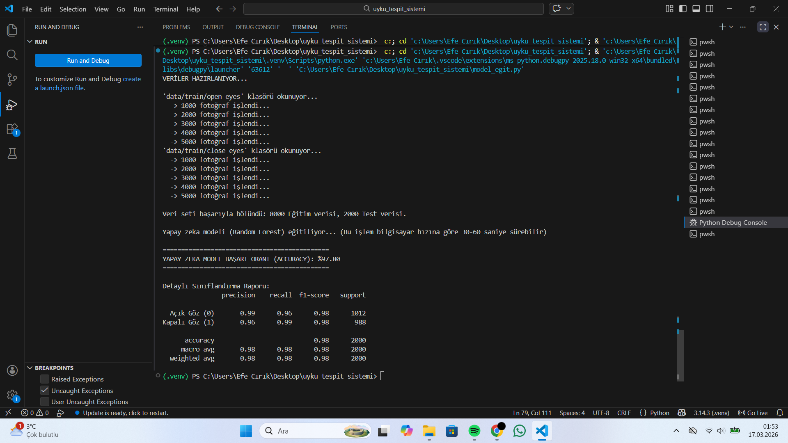

# 🚗 Sürücü Uyku ve Yorgunluk Tespit Sistemi

Bu proje, bilgisayarlı görü (computer vision) teknikleri kullanılarak sürücülerin anlık durumunu analiz eden ve olası uyku/yorgunluk belirtilerinde uyarı veren bir yapay zeka sistemidir.

Sistem, kamera üzerinden yüz hatlarını ve önemli noktaları (facial landmarks) tespit eder. Özellikle göz kapanma süresi ve esneme gibi fiziksel yorgunluk belirtilerini anlık olarak takip ederek olası kazaların önüne geçmeyi amaçlar.

## 📸 Sistemden Görüntü


## 🛠️ Kullanılan Teknolojiler
* **Dil:** Python
* **Görüntü İşleme & Yüz Tespiti:** OpenCV, Dlib
* **Model:** `face_landmarker.task` kullanılarak yüz referans noktası analizi

## 🚀 Nasıl Çalıştırılır?
Projeyi kendi bilgisayarınızda denemek için aşağıdaki adımları izleyebilirsiniz:

1. Proje dosyalarını bilgisayarınıza indirin.
2. Gerekli kütüphanelerin (OpenCV, Dlib vb.) kurulu olduğundan emin olun.
3. Terminal veya komut satırını proje dizininde açarak aşağıdaki komutu çalıştırın:
   ```bash
   python test.py
